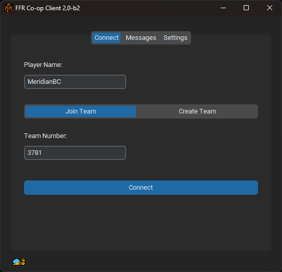

# Co-op 2.0
## for Final Fantasy Randomizer

This project is a modern client for FFR Co-op written in Python with TK gui components. It uses the Archipelago BizHawk client connector lua instead of a custom connector and requires no extra DLL installation.



### Prerequisites
- BizHawk (version 2.4 or later recommended)
- Python 3.8 or later (if running from source)
- A Final Fantasy Randomizer ROM.


## Running the Client
### Windows

Download the latest release and run the .exe. Load your FFR ROM in BizHawk, open the lua console and load either the included `bizhawk-connector/connector_bizhawk_generic.lua` or the generic BizHawk connector included with [Archipelago](https://archipelago.gg/). Configure the server address/port and your player name in the client and use the connect tab to either create or join a team.

### Running from source

First, install the required dependencies:
```bash
pip install -r requirements.txt
```

You can run the GUI client by executing:
```bash
python gui.py
```

Alternatively, the CLI client can be used:
```bash
# To initialize a new team
python main.py --player YourName --init

# To join an existing team
python main.py --player YourName --join <team_number>
```
You can configure default settings, such as the `ServerAddress`, in `config.ini`.

## Deploying the Server

Version 2.0 of the backend server is located in the `server` directory.

### Using Docker (Recommended)

The easiest way to deploy the server is by using the provided `docker-compose.yml`:
```bash
cd server
docker compose up --build -d
```

### Manual Setup

If you prefer to run the server manually without Docker using Python 3.9 or later:
```bash
cd server
pip install -r requirements.txt
python app.py
```
